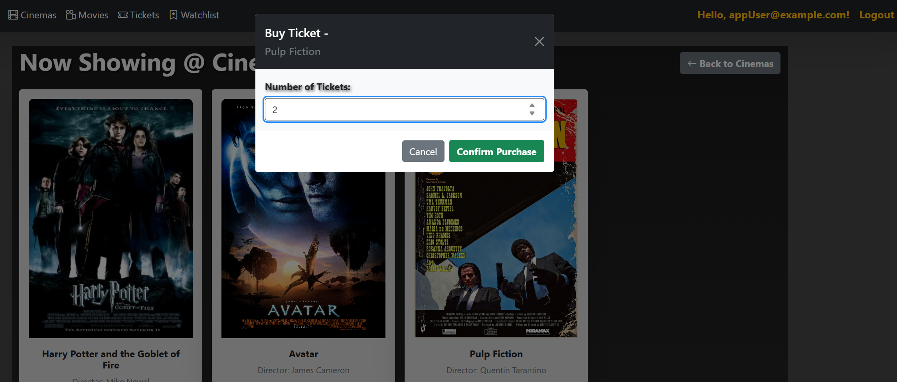
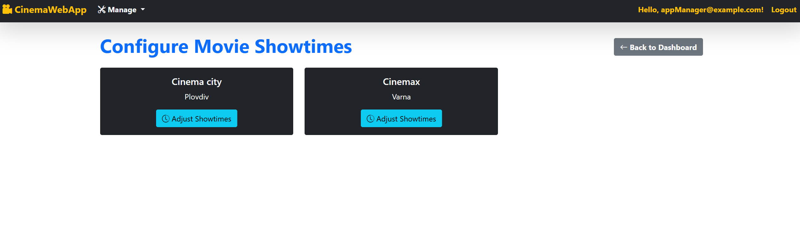

# 🎬 CinemaApp – ASP.NET Core MVC Project

## 🌟 Overview

**CinemaApp** is a learning project developed in ASP.NET Core MVC as part of the SoftUni C# Web Developer Path (September 2024 edition). It provides functionality for managing movies, cinemas, watchlists, and ticket purchases with a clean architecture and layered structure.

---

## 📂 Project Structure

* `CinemaApp.Data` – Entity models, DbContext, and seed data
* `CinemaApp.Models` – ViewModels used in the presentation layer
* `CinemaApp.Services` – Business logic and service layer
* `CinemaApp.Web` – MVC presentation layer (controllers + views)
* `CinemaApp.Common` – Constants and validation rules
* `CinemaApp.Tests` – Unit testing using NUnit and Moq

---

## 🛠 Technologies Used

* ASP.NET Core MVC 8.0
* Entity Framework Core
* SQL Server
* ASP.NET Identity
* Bootstrap 5 (UI Styling)

---

## 🔐 Roles & Permissions

| Role    | Capabilities                                |
| ------- | ------------------------------------------- |
| Admin   | Full access: manage users, movies, cinemas  |
| Manager | Manage movies, cinemas, and ticket settings |
| User    | Add to watchlist, buy tickets, view tickets |

---

## 📊 Features

### Public (Not Logged In)

* Browse all cinemas and movies

### Registered User

* Add/remove movies to/from Watchlist
* View watchlist
* Purchase tickets
* View owned tickets

### Manager

* Create/edit/delete cinemas and movies
* Manage ticket availability per cinema and movie

### Admin

* Manage users and roles
* Admin dashboard area

---

## 🧱 Key Models

* `Movie`
* `Cinema`
* `Ticket`
* `UserMovie` (Watchlist)
* `ApplicationUser` (inherits from `IdentityUser`)

---

## 🧪 Getting Started

### 1. Clone the repository

```bash
git clone https://github.com/KTsaneff/ASP.NET-Core-SoftUni-CSharpWeb-Sept-2024-CinemaApp.git
```

### 2. Open in Visual Studio

* Open the `.sln` file
* Restore NuGet packages

### 3. Apply migrations

Open the Package Manager Console and run:

```powershell
Update-Database
```

### 4. Run the application

Press **F5** or click **Start Debugging** in Visual Studio.

---

## 📸 Screenshots

### Home Views

* 
* 
* 
* 

### Movie Browsing

* 
* 

### Cinemas & Programs

* 
* 

### Movie Details & Watchlist

* 
* 

### Tickets

* 
* 

### Manager Views

* 
* 
* 
* 
* 
* 

### Admin Views

* 
* 
* 

---

## 📚 Educational Goals

This project helps students learn:

* ASP.NET Core MVC fundamentals
* Entity Framework Core with Migrations and Seed Data
* Service and repository patterns
* ASP.NET Identity and role-based authorization
* Clean architecture structure

---

## 📬 Contributions

This project is part of a course and not open for contributions at this time.

---

## 📄 License

MIT License (if applicable)
